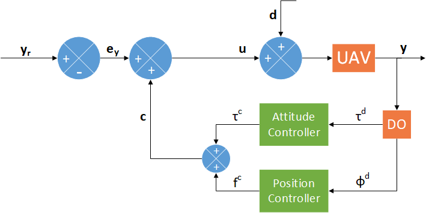
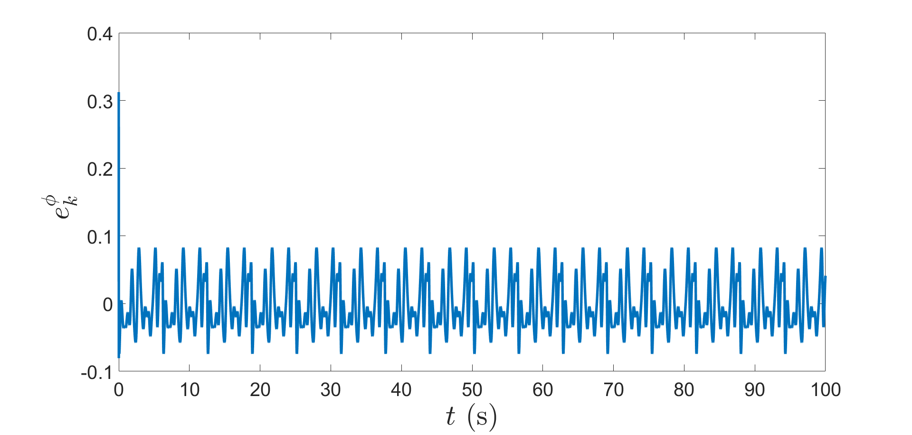
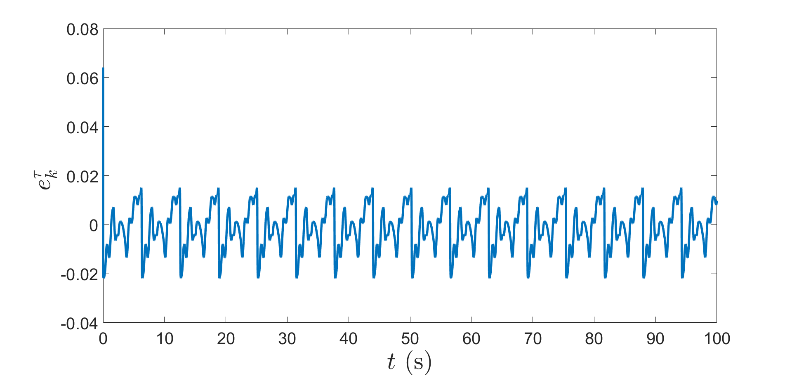
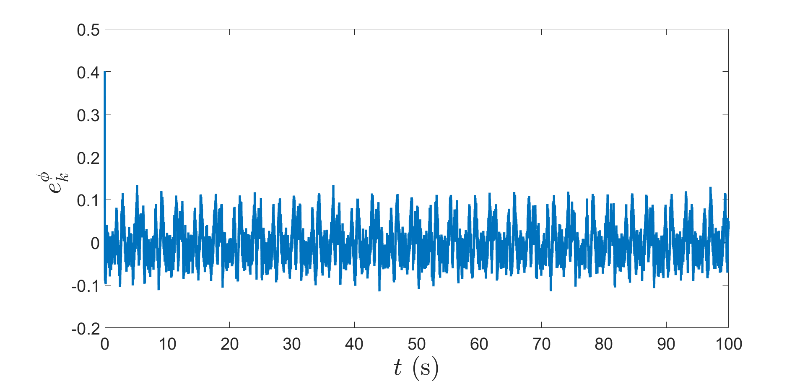
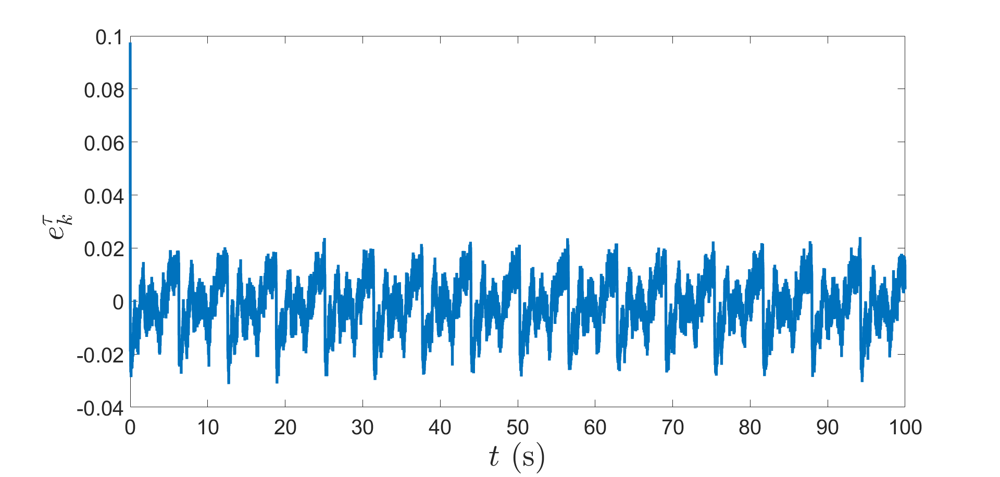
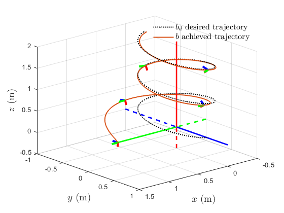
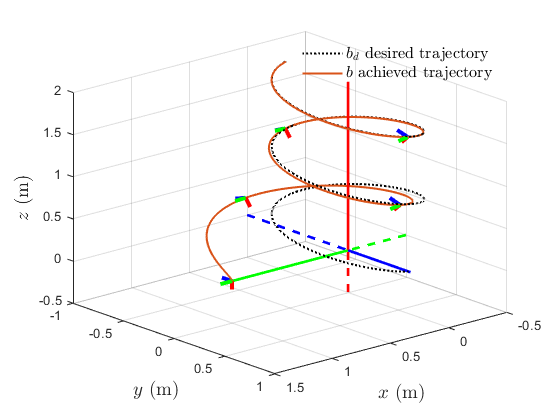
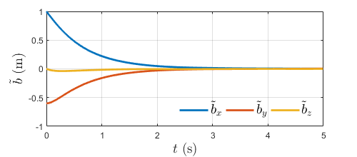

# Disturbance-Prediction-UAV

This work provides the code for a finite-time stable disturbance observer design for the discretized dynamics of an unmanned vehicle in three-dimensional translational and rotational motion. The dynamics of this vehicle is discretized using a Lie group variational integrator as a grey box dynamics model that also accounts for unknown additive disturbance force and torque. Therefore, the input-state dynamics is partly known. The unknown dynamics is lumped into a single disturbance force and a single disturbance torque, both of which are estimated using the disturbance observer we design. This disturbance observer is finite-time stable (FTS) and works like a real-time machine learning scheme for the unknown dynamics.

This work was presented in American Control Conference 22 held in Atlanta, Georgia in May, 2022. The link to the full paper is [here](https://ieeexplore.ieee.org/abstract/document/9867308).

The control system architecture is shown below with the disturbance observer in the feedback loop to estimate the force and torque disturbances. The position and attitude controller in loop with the DO are also developed with asymptotic stability in mind.

#### Control System Architecture

Dynamic turbulent wind effects are difficult to model exactly, even with the use of detailed CFD analysis and simplifying assumptions for the wind fields. The uncertainties that exist in a realistic wind field contain a variety of different atmospheric sources like turbulence, vortex, gust and shear. Despite this, a combination of sinusoidal wave-forms are generally sufficient to capture the dominant characteristics that exist in a realistic wind field. To this avail, the wind disturbance is simulated here as a combination of sinusoidal frequencies. To make the wind model more realistic and close to a real-world environment, lower frequency signals of relatively high amplitude are combined with higher frequency signals of relatively low amplitude, with the frequencies being not more than 10 Hz. The total magnitude of the force and torque disturbance is of the order of ~5-7 N and ~1-2 N-m, respectively.

The simulation results are depicted next:

#### Results without measurement noise

#### Results with measurement noise

The simulation results for the trajectory correction with an asymptotically-stable feedback controller for position and attitude are presented next.

#### Trajectory without correction

#### Trajectory with correction

The position and attitude tracking error is also asymptotically stable:

This work obtains discrete time state feedback tracking control laws for a rigid body using a grey box dynamics model that has unknown disturbance force and disturbance torque inputs. A finite-time stable disturbance observer is used to compensate these disturbance inputs in the control scheme. The position and attitude tracking control laws are shown to be nonlinearly stable and robust in tracking reference position and attitude trajectories while compensating the disturbances in real-time. The tracking errors are shown to ultimately converge to bounded neighborhoods of zero errors in an asymptotically stable manner.
